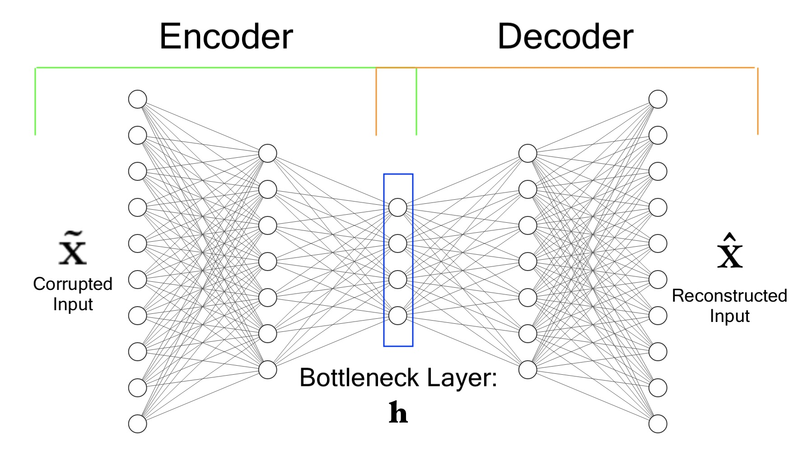

# SDAE

## Description
SDAE is a package containing a stacked denoising autoencoder built on top of the keras Sequential and Model class that can be used to conveniently perform feature extraction on high dimensional tabular data. 
    
The SDAE is a seven layer neural network designed to pass  input data through "bottleneck" middle layer before outputing a reconstruction of the input data as a prediction. Noise is introduced during training using dropout, and model is trained on reconstruction loss.



## Features
* Adjustable noise levels
* Custom layer sizes
* Automatically plot reconstruction loss 

## Motivation

Stacked denosing autoencoders can be a very powerful method of dimensionality reduction and feature extraction; However, implementation can be time consuming.

The goal of this package is to provide a flexible and convenient means of utilizing SDAEs using Scikit-learn-like syntax while preserving the funcionality provided by Keras.

## Installation

```bash
pip install SDAE
```

## Usage

Assume\
Training data: train_data \
Test data: test_data

```python
from SDAE import StackedDenoisingAutoencoder

# Instantiate
SDAE_Model = StackedDenoisingAutoencoder(50, 5, 100, verbose= True)

# Train model
SDAE_Model.fit(X_train)

#Plot reconstruction loss during training
SDAE_Model.plot_loss()

#Access Keras model and functionality such as summary()
SDAE_Model.model.summary()

#Perform feature extraction
New_X_train = SDAE_Model.transform(X_train)
New_X_test = SDAE_Model.transform(X_test)
```

## Contributing
Pull requests are welcome.

## License
[MIT](https://choosealicense.com/licenses/mit/)
